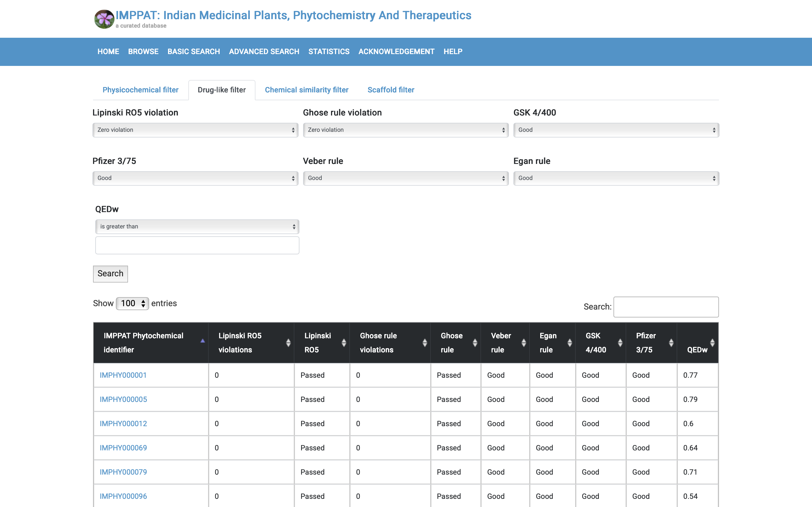
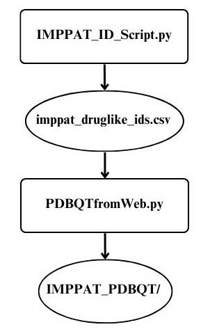

# IMPPAT_Database_VS

## Table of Contents

- [Requirements](#requirements)
  - [Python Version](#1-python-version)
  - [Python Packages](#2-python-packages)
  - [Web Browser](#3-web-browser)
- [Description of Primary Constraint](#description-of-primary-constraint)
- [The Solution](#the-solution)
- [Overall Flow](#overall-flow)
- [Citation for IMPPAT Database](#citation-for-imppat-database)

## Requirements

To run the provided scripts for extracting and downloading data from the IMPPAT database, ensure your environment meets the following requirements:

### 1. Python Version

- **Python 3.8 or higher** is recommended.

### 2. Python Packages

Install the following Python packages using `pip`:

- **selenium**  
  For browser automation and web scraping.

- **webdriver-manager**  
  Automatically manages the correct version of the ChromeDriver.

- **pandas**  
  For handling CSV files (used in the second script).

- **requests**  
  For downloading files from the web.
  
### 3. Web Browser

- **Google Chrome**  
  The scripts use ChromeDriver to automate Chrome. Make sure Chrome is installed on your system.

## Description of Primary Constraint
The main challenge behind scraping data from the [IMPPAT](https://cb.imsc.res.in/imppat/) database is the following condition - to download each structure file, one must visit its designated webpage in the database. There is no other method to download the structure. A virtual screening requires several molecules to be docked/screened against a target receptor. Hence, it becomes impractical to manually visit each molecule's webpage to extract its structure. Most databases usually have the clickable download link adjacent to the molecule name/ID which makes scraping them more comfortable. 

---

## The Solution:
As mentioned earlier, each molecule has a webpage containing its structure files. Incidentally, this webpage has a URL of the following form: 
`f"{BASE_URL}{IMPHY ID}`
Extracting the structure file from a list of IMPHY IDs(`.csv`) is carried out by `PDBQTfromWeb.py` where the user can specify what kind of structure file they require by changing the field within `By.XPATH` on line 64. The respective tag for the structure file of your interest can be known from inspecting the structure file icon element.
Having figured out how to download structure file for a csv of IMPHY IDs, we want to now populate the csv with molecules of our choice.
The IMPPAT database lets you apply filters in the `ADVANCED SEARCH` option so that you can view molecules of your choice. What appears is a list of clickable IMPHY IDs which lead you to the molecule's webpage.

However, for our purposes, it would suffice to simply 'note down' all the IMPHY IDs onto an output csv, which can then be used as input to `PDBQTfromWeb.py`. If these IMPHY IDs were manageable in number, we could have literally noted them down on a csv. However, in most real-life scenarios, the number of molecules satisfying the conditions of your filters is going to be too large to do that. So, we need to automate this process as well, thereby employing `IMPPAT_ID_Script.py`, which writes the relevant IMPHY IDs onto `imppat_druglike_ids.csv`(included in this repository). 
For my application, I applied the druglike filters. However, the filters can easily be customised in `IMPPAT_ID_Script.py` as per choice of the reader.

---

## Overall Flow

>
 Customise Filters in IMPPAT_ID_Script.py -> Run PDBQTfromWeb.py 

  

---

### Citation for IMPPAT Database
> Mohanraj, K., Karthikeyan, B. S., Vivek-Ananth, R. P., Chand, R. P., Aparna, S. R., Mangalapandi, P., & Samal, A. (2018). IMPPAT: A curated database of Indian Medicinal Plants, Phytochemistry And Therapeutics. *Scientific Reports*, 8, 4329. https://doi.org/10.1038/s41598-018-22631-z

